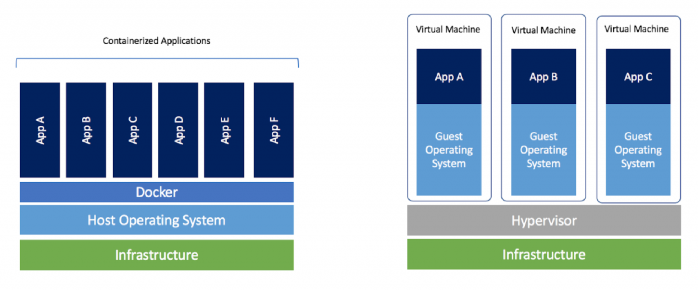
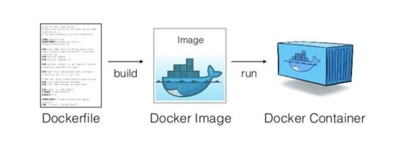

# Docker curso completo

## Que es Docker

Docker es un contenedor que te permite tener tus aplicaciones siempre en un mismo entorno, esto quiere decir que todas las dependencias de la aplicacion va a estar contenidas en el contenedor. Este contenedor vamos a poder moverlas de una maquina a otra y dichas dependencias van a estar siempre ahi (sandbox).

Docker va a correr un contenedor, a partir de una imagen. Esa imagen tiene:
* Un OS (Ubuntu, Debian, CentOS)
* El Software que nos permite correr la aplicacion
* La aplicacion en si.

## Diferencias entre docker y maquina virtual



- En una maquina virtual, podes correr la aplicacion junto con el sistema operativo. Y, si se necesita crear otro sistema operativo, se puede crear otra maquina virtual para poder correr la aplicacion junto con dicho sistema operativo. Todo esto corre sobre un `Hypervisor` y una infraestructura (como un servidor o la propia computadora de escritorio).
- Con docker, sacamos una de esas capas y simplemente se corre la aplicacion, junto con los archivos que la aplicacion necesita para correr incluido la distribucion de Linux. El kernel esta compartido en cada una de las aplicaciones para que las podamos correr. La desventaja es que Docker solo puede correr en un Sistema Operativo Linux.

## Dockerfile

Dockerfile es un archivo, que tiene una serie de instrucciones, e indican como crear una imagen. Despues se corre el comando `docker build` que genera la imagen. Luego, si queremos correr el contenedor, usamos `docker run` basados en dicha imagen.



La ventaja es que se puede usar la imagen de otra persona, sin la necesidad de crearla desde 0 a mano.

Las imagenes se hostean en [dockerhub](https://hub.docker.com/), que es el sitio oficial.

## Comandos

Muchos comandos se pueden conocer usando `man`:

```bash
man docker
```

O si se quiere saber sobre un subcomando en especifico

```bash
man docker run
```

O a traves de argumento `--help`

```bash
docker run --help
```

## Ejemplos

El comando `run` corre la imagen de postgres, sino existe en la maquina la descarga desde dockerhub.

```bash
docker run postgres
```

Despues del nombre de la imagen, se puede usar `:`, que significa el `tag` o sabor de la imagen. Quiere decir que version vas a usar de la imagen, por defecto es la ultima version.

```bash
docker run postgres:15.17-alpine3.22
```

En el caso de la imagen de `postgres`, requiere un comando extra:

```bash
Error: Database is uninitialized and superuser password is not specified.
       You must specify POSTGRES_PASSWORD to a non-empty value for the
       superuser. For example, "-e POSTGRES_PASSWORD=password" on "docker run".

       You may also use "POSTGRES_HOST_AUTH_METHOD=trust" to allow all
       connections without a password. This is *not* recommended.

       See PostgreSQL documentation about "trust":
       https://www.postgresql.org/docs/current/auth-trust.html
```
Por ahora, simplemente le hacemos caso...

Tambien se puede correr desde background con la opcion `-d`

```bash
docker run -d nginx
```

Otro comando util es:

```bash
docker images
```

Permite ver todas las imagenes que estan hosteadas en el sistema operativo.

Este comando nos permite ver los contenedores corriendo en el momento

```bash
docker ps
```

Docker exec ejecuta un comando en un contenedor que ya esta corriendo

```bash
docker exec -it 84bb
```

* -i: genera una session iterativa
* -t: genera una terminal
* 84bb: es parte del id del contenedor

### Ejemplo de Dockerfile

```yml
FROM node:12.22.1-alpine3.11

WORKDIR /app
COPY . .
RUN yarn install --production

CMD ["node", "./app/src/index.js"]
```

Todos los `Dockerfiles` comienzan con `FROM ...`, que define la imagen en la que se estan basando.
Luego viene `WORKDIR /APP`, que resulta ser el directorio interno donde va a trabajar la aplicacion.
`RUN yarn install --production` corre un comando en tiempo de construccion del contenedor.
Finalmente, `CMD ["node", "./app/src/index.js"]`

Con `docker build` se construye el contenedor

```bash
docker build -t getting-started .
```

La opcion `-t`, que significa `tag`, sirve para darle un nombre al contenedor. Sino se tendria que usar el id.

Para correr el contenedor usamos

```bash
docker run getting-started
```

El problema que es el puerto que nos devuelve no se puede usar en la red interna del host. Para eso hay que exponerlo usando

```bash
docker run -p 3000:3000 getting-started
```

Con `docker stop` detenemos el contenedor. Si luego quisieramos usarlo nuevamente lo corremos con `docker run`. Pero el problema es que todos esos datos se perdieron. Esto es asi porque docker volvio a crear un nuevo contenedor.

### Volumenes persistentes

Para poder persistir esos datos usamos

```bash
docker run -v $HOME/Descargas/fiuba/intro_desarrollo_software/ejemplo-docker/app/etc:/etc/todos -dp 3000:3000 getting-started
```

`-v` indica donde tiene que ir a buscar esos datos guardados, a esto se lo conoce como volumen persistente.
Ahora no importa si detenemos el contenedor si lo eliminamos, siempre que le pasemos `-v PATH` podremos recuperar los datos.
El enlace es bidireccional, eso quiere decir que cualquier cambio en `app/etc:/etc/todo.db` se va a modificar dentro del contenedor y viceversa.
El `PATH` es estandar y viene en la documentacion de la imagen en dockerhub.

## Recurso
[DOCKER De NOVATO a PRO! (CURSO COMPLETO EN ESPAÑOL)](https://www.youtube.com/watch?v=CV_Uf3Dq-EU)
