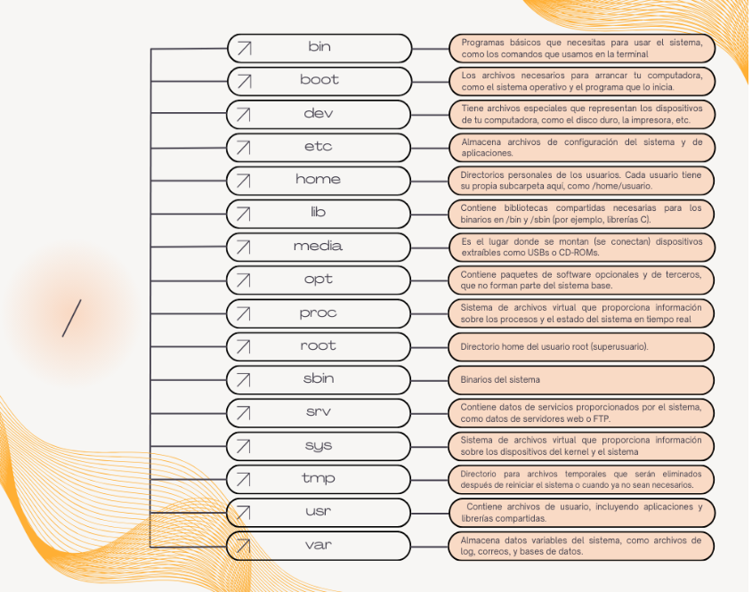

# Linux

## Que es Linux?

Linux, a menudo usado para referirse a un sistema operativo, en realidad se trata de un _kernel_, que es el *nucleo que gestiona la comunicacion entre el sistema operativo y el hardware*. Aunque el kernel es una parte fundamental para el sistema operativo, Linux por si solo no es un sistema operativo completo y necesita de otras bibliotecas, herramientas y utilidades que proporcionan una interfaz para el usuario.

En su esencia, Linux es un sistema operativo _Unix-like_, lo que significa que comparte caracteristicas y conceptos fundamentales con sistemas operativos unix.

## Que es un sistema operativo "Unix-like"?

Un sistema operativo _Unix-like_ es un tipo de software que funciona de manera parecida a Unix. Aunque estos sistemas no tienen que ser identicos a Unix, comparten similudes tales como:

* **Estructura de archivos:** Organizan los archivos en una *forma jerarquica*, parecida a un arbol, comenzando de sde un directorio raiz (/) y dividiendose en carpetas y subcarpetas. El directorio raiz contiene archivos y subdirectorios que contienen mas archivos y subdirectorios.

**Para navegar esta estructura, se utilizan dos tipos de rutas:**

| Rutas Absolutas | Rutas Relativas |
| :--- | :---: | ---: |
| Este tipo de rutas comienzan desde el directorio raiz (/) y siguen la jerarquia de la sistema de archivos hasta llegar al archivo o directorio deseado. Las rutas absolutas siempre inicial desde el directorio raiz. | Estas rutas comienzan desde el directorio de trabajo actual. El simbolo "." representa el directorio de trabajo actual, mientras que ".." representa al padre. |

* **Interfaz de lineas de comandos:** Permite a los usuariosescribir comandos en lugar de hacer click con el raton.

* **Multitarea y mutiusuario:** Puede manejar varias tareas al mismo tiempo y permitir que multiples personas usan el sistema simultaneamente.

* **POSIX (Portable Operating System Interface):** Es un estandar ue define reglas y especificaciones sobre com deben comportarse los sistemas perastivos para garantizar la compatibilidad entre ellos.

## Linea de comandos y shell

la Linea de comandos de un sistema operartivo es una interfaz basada en texto para interactuar directamente con el sistema operativo de la computadora. Permite ejecutar tareas, gestionar archivos y automatizar procesos mediante comandos escritos, siendo más rápida y eficiente que la interfaz gráfica (GUI) para usuarios avanzados y tareas de desarrollo.

## Que es shell?

Shell es un programa que actua como intermediario entre quien usa la linea de comandos y el sistema operativo. Se encarga principalmente de tomar los comandos que el usuario escribe y traducirlo en acciones que el sistema operativo puede ejecutar.

## Como funciona?

1. **Se ingresa un comando:** Abrimos terminal y en el prompt de la shell ingresamos un comando, (ej.: `ls` para listar archivos y directorios).
2. **El shell lo procesa:** El shell lo toma y lo envia al sistema operativo.
3. **El sistema operativo ejecuta el comando:** en nuestro caso lista los archivos y carpetas en la terminal.
4. **El shell muestra el resultado:** Finalmente, se muestra el resultado en la pantalla.

*Bash (Bourne Again Shell)* es la shell por defecto en la mayoria de las distribuciones de Linux.

## Uso basico de la terminal

* **Historial de comandos:** con las flechas arriba y abajo podes recorrer el historial de comandos que escribiste.

* **Mover el cursor:** con las flechas izquierda y derecha podes mover el cursor dentro de la linea de comandos, pudiendo asi modificar el texto debajo de cursor (por ejemplo).

* **Copiar y pegar:** seleccionando (o "pintando") la zona que se quiere copiar, si haces `CTRL-SHIFT-C` copiar el texto seleccionado. Para pegar simplemente apretas `CTRL-SHIFT-V`.
